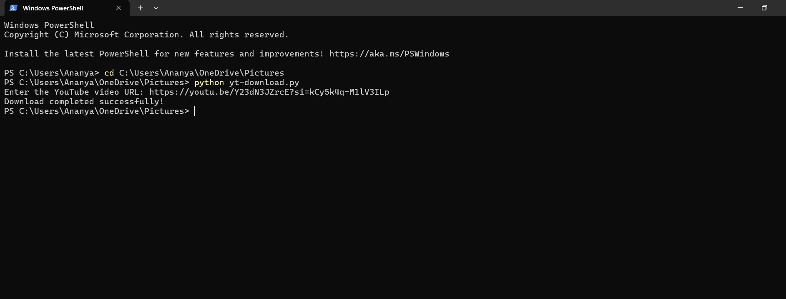

# How to Use the Python YouTube Downloader

* Write your Python code for downloading the YouTube video.
* Save the file with a name like `downloader.py`.


* Open any Python runner **or** your system terminal.
* Run the file using:

  ```bash
  python downloader.py
  ```
  

* The video will be automatically saved to the folder you specified in your code.
* No further action needed.

